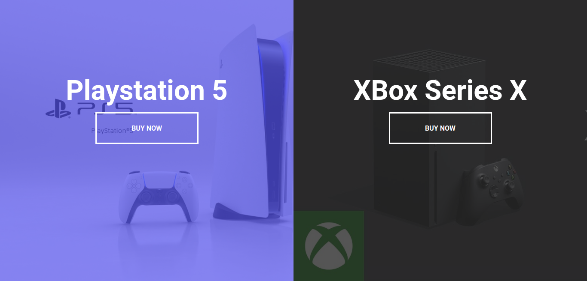
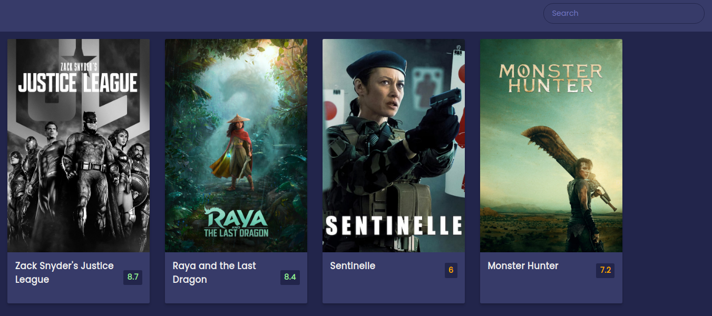
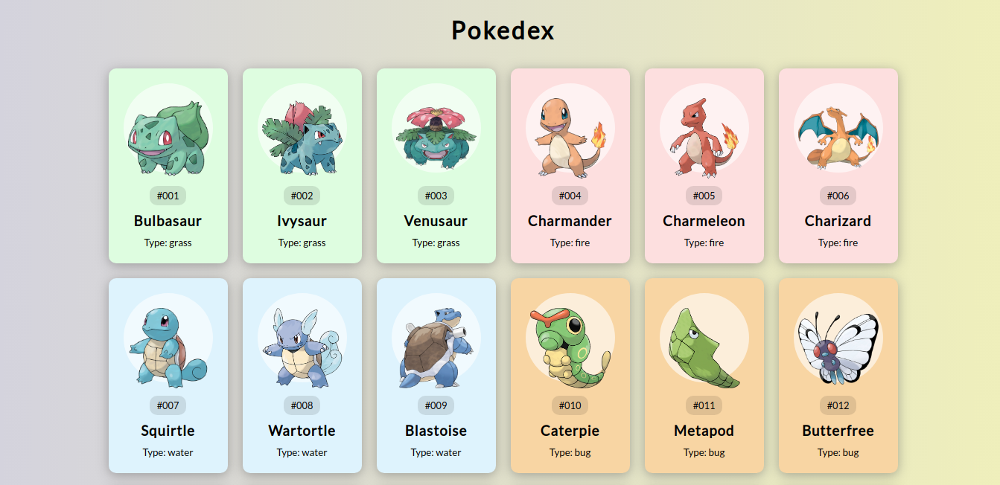

<h1 align="center">
	<a href="#"> 50 projetos em 50 dias</a>
</h1>

50+ miniprojetos feitos com HTML, CSS e Javascript puro.

<h5 align="center">
	🚧   Em construção  🚧
</h5>

## Sobre

O objetivo do projeto é realizar a cada dia um projeto novo, para práticar e solidificar a base nas técnologias utilizadas.

### Alguns projetos que serão feitos

 
Landing page:

Buscador de filmes:

Pokedex:

### Projetos criados

# | Projeto   | Deployed |
- | --------- | --------- |
1 | Expanding cards | [Deployed](https://exapanding-cards-mmdev.netlify.app)
2 | Progress steps  | [Deployed](https://progress-steps-mmdev.netlify.app)

 
Entre outros.

> Disclaimer: Projeto inspirado no curso: [50 Projects in 50 days](https://www.udemy.com/course/50-projects-50-days/) by [Florin Pop](https://www.florin-pop.com)

### Licença

<a href="./MIT-LICENSE.txt">The MIT License</a> e alguns direitos [aqui.](https://traversymedia.com)
